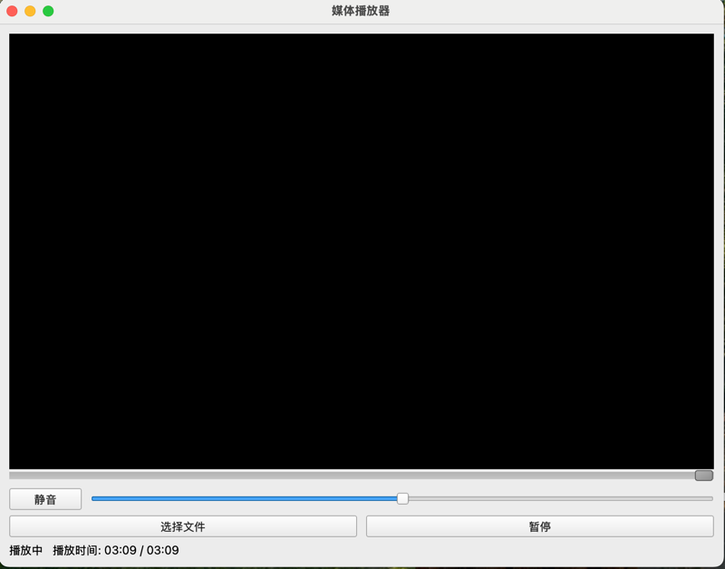

# 媒体播放器项目
## 项目简介
这是一个基于 **PySide6** 框架构建的多媒体播放器应用，支持播放常见的音频和视频文件。项目主要包含媒体播放逻辑、文件选择功能以及简洁直观的图形用户界面。

## 功能特性
- 支持播放多种音频和视频文件格式（如 `.mp3`、`.wav`、`.mp4` 等）。
- 图形化用户界面，支持以下功能：
  - 文件选择
  - 播放/暂停切换
  - 调节音量
  - 视频播放窗口
- 默认打开操作系统的下载目录，让文件选择更便捷。
- 支持日志记录功能，帮助排查播放过程中的问题。

## 使用技术
- Python `3.1.3`
- PySide6`6.8.1.2`

## 项目结构
   ```
   /play
   ├── core/
   │   ├── player.py          # 核心播放器逻辑
   │   ├── file.py            # 文件选择及文件处理逻辑
   ├── gui/
   │   ├── ui.py              # UI 初始化逻辑
   ├── static/
   │   ├── icons/             # 图标文件 (.png)
   ├── main.py                # 入口文件
   ```

### 文件说明
1. **main.py**  
   应用程序的入口文件，负责创建及运行播放器界面。支持通过命令行传入文件路径直接播放。

2. **core/player.py**  
   实现媒体播放的核心逻辑，基于 **QMediaPlayer** 和 **QAudioOutput** 的 API。  
   包含以下主要功能：
   - 加载并播放文件
   - 切换播放/暂停状态
   - 音量调节
   - 媒体状态处理

3. **core/file.py**  
   文件选择和处理逻辑的封装，支持跨平台获取默认下载目录，并提供文件选择的功能。

4. **gui/ui.py**  
   播放器的图形用户界面构建，基于 **PySide6** 的 GUI 框架。  
   包括以下主要控件：
   - 视频播放窗口
   - 音量滑块
   - 状态显示标签
   - 播放/暂停按钮
   - 文件选择按钮

5. **requirements.txt**  
   包含项目所需依赖包的信息。

## 安装与使用
### 环境要求
- Python 版本 >= 3.10
- 操作系统：Windows / MacOS / Linux

### 安装步骤
1. 克隆代码到本地：
   ```bash
   git clone <https://github.com/MrCJR/play.git>
   cd <https://github.com/MrCJR/play.git>
   ```

2. 创建并激活虚拟环境：
   ```bash
   python -m venv venv
   source venv/bin/activate   # Linux/MacOS
   venv\Scripts\activate      # Windows
   ```

3. 安装依赖：
   ```bash
   pip install -r requirements.txt
   ```

4. 运行应用：
   ```bash
   python main.py
   ```

## 使用说明
- 界面布局：
  - **选择文件**：打开文件选择对话框，支持多种媒体格式文件。
  - **播放/暂停**：切换当前播放状态。
  - **音量滑块**：水平滑动以调整播放音量。
  - **视频窗口**：支持视频画面输出。
  - **状态标签**：显示当前文件加载状态或当前操作提示。
- 日志输出：日志信息会在控制台输出，如播放失败、文件未找到等。

### 支持的文件格式
- 音频文件：`.mp3`、`.wav`、`.ogg`
- 视频文件：`.mp4`、`.avi`、`.mkv`

## 项目扩展
该项目已实现基础的媒体播放功能，可以进一步扩展以下功能：
1. 支持播放列表功能。
2. <span style="color: green;">添加播放进度条组件。✔已完成（2025/2/14）</span>
3. 增加更多文件格式支持。
4. 优化错误处理与提示信息。
5. 美化用户界面。

## 已知问题
- 静音按钮功能实现问题。 <span style="color: green;">✔已解决（2025/2/14）</span>

## 开发者信息
- 如果您有任何问题或建议，请提交 Issue 或联系开发者。
---
Happy coding! 😊

---